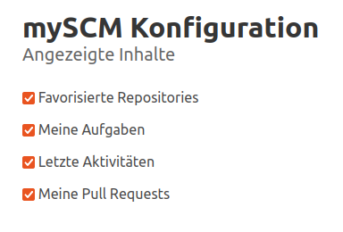

Jeder Benutzer kann konfigurieren, welche zusätzlichen Widgets angezeigt werden.
Darüber hinaus können archivierte Repositories verborgen und die Seitengröße der
Repository-Übersicht angepasst werden.
Diese Information wird lokal gespeichert und ist keinem Benutzer zugeordnet.

