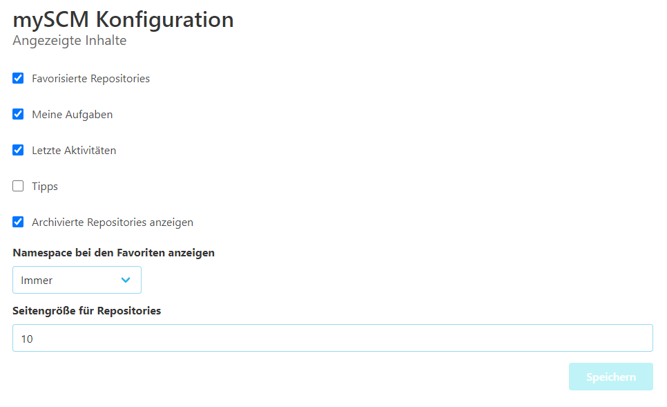

Jeder Benutzer kann konfigurieren, welche zusätzlichen Widgets angezeigt werden.
Diese Information wird lokal gespeichert und ist keinem Benutzer zugeordnet.
Änderungen haben sofortige Auswirkungen.

