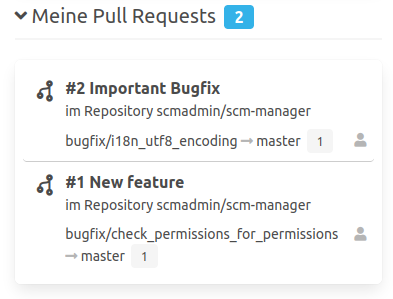

Der Bereich "Meine Daten" bietet eine schnelle Übersicht der eigenen und favorisierten Daten im SCM-Manager. Es können dabei nur Daten angezeigt werden, auf welche der Benutzer berechtigt ist.

### Favorisierte Repositories
Durch das Landingpage-Plugin gibt es die Möglichkeit Repositories als Favoriten (Stern) zu markieren. 
Wird ein Repository vom einem Benutzer favorisiert, erscheint es auf der persönlichen Startseite "mySCM".

### Meine Pull Requests
Wurde zusätzlich zum Landingpage-Plugin auch das Review-Plugin installiert, werden die eigenen Pull Requests ebenso unter dem Bereich "Meine Daten" angezeigt.

