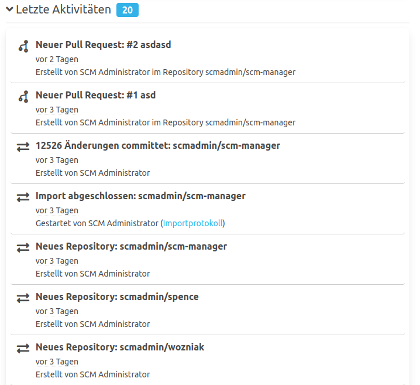

Die letzten Aktivitäten bilden alle Benutzer relevanten Events innerhalb des SCM-Managers chronologisch ab. 
Die Benutzer sehen ausschließlich Aktivitäten in Bereichen, zu denen sie berechtigt sind.

Wenn beispielsweise neue Commits auf ein Repository gepusht wurden, sehen nur Benutzer mit Lese-Berechtigung auf dieses Repository diese Aktivität.

