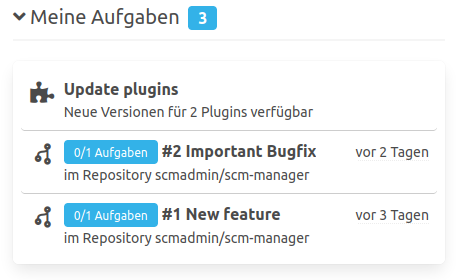

Beim Arbeiten mit dem SCM-Manager ist es möglich, dass Benutzer Aufgaben erhalten. Diese Aufgaben können sich beispielsweise auf das Verwalten der SCM-Manager Instanz beziehen. 
Wurde das Review-Plugin installiert, können zusätzlich Aufgaben in offenen Pull Requests anfallen.

### Administrative Aufgaben
Die administrativen Aufgaben werden jedem Benutzer angezeigt, der die nötigen Rechte besitzt, um sie umzusetzen.
Unter administrative Aufgaben fallen zum Beispiel das Aktualisieren von Plugins.

### Aufgaben aus Pull Requests
Wenn ein Benutzer einen Pull Request eröffnet, haben die Reviewer die Möglichkeit Aufgaben innerhalb des Pull Requests zu eröffnen, um Ihre Änderungswünsche auszudrücken. 
Diese Aufgaben werden dem Autoren des Pull Requests unter "Meine Aufgaben" angezeigt.

