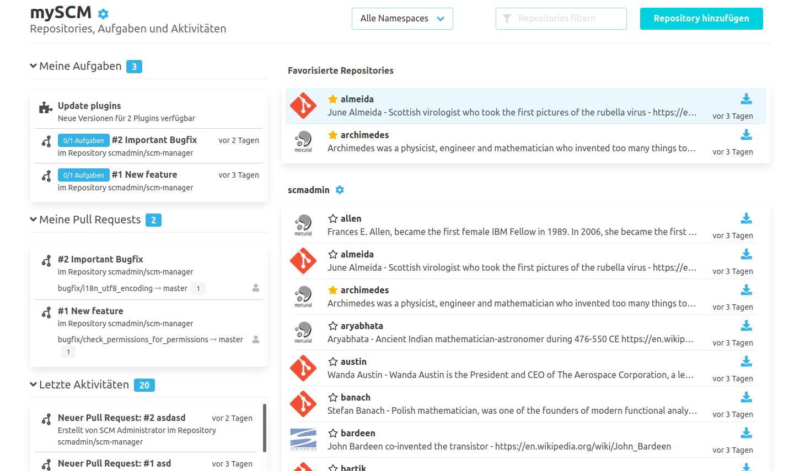

Die Repositoryübersicht wird durch eine Anzahl von Widgets erweitert, welche nützliche Informationen bereitstellen.
Die einzelnen Bereiche "Meine Aufgaben", "Meine Daten" und "Letzte Aktivitäten" sind dabei alle Benutzer bezogen und durch Berechtigungsprüfungen gefiltert.
Was angezeigt wird kann konfiguriert werden. Andere Plugins können mit diesem plugin integrieren, um eigene Informationen
anzuzeigen oder bestehende Anzeigen anzureichern.

