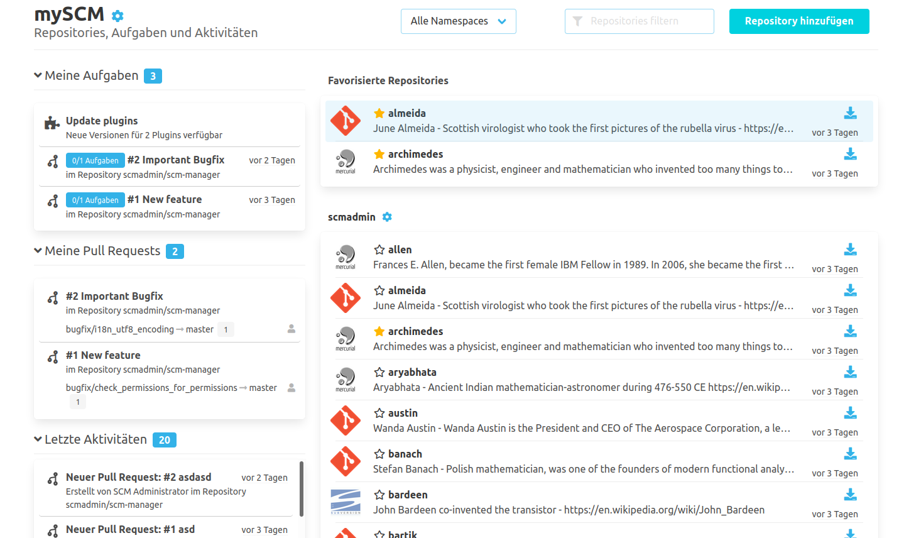

Die Repositoryübersicht wird durch eine Anzahl von Widgets erweitert, welche nützliche Informationen bereitstellen.
Die einzelnen Bereiche „Meine Aufgaben“, „Meine Daten“ und „Letzte Aktivitäten“ sind allesamt benutzerbezogen 
und durch Berechtigungsprüfungen gefiltert.
Die Elemente können von den Benutzern konfiguriert werden. Andere Plugins können mit diesem Plugin interagieren, 
um eigene Informationen anzuzeigen oder bestehende Anzeigen anzureichern.

Darüber hinaus kann der Titel der Instanz (per Default „mySCM“) angepasst werden. Diese Einstellung kann von
Administratoren unter „Einstellungen – Landingpage“ vorgenommen werden.

