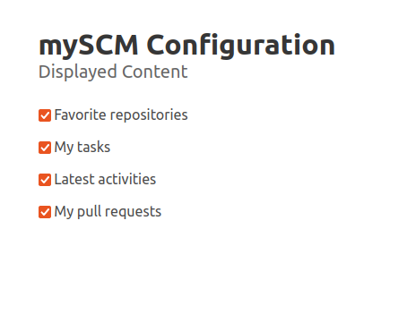

Each user can configure which additional widgets are displayed.
Additionally it is possible, to hide archived repositories and to
change the page size for the repository overview.
It is also possible to show the namespace in the favorites or to show the namespace if there are duplicate names in the favorites.
This information is stored locally and is not associated with a user.

