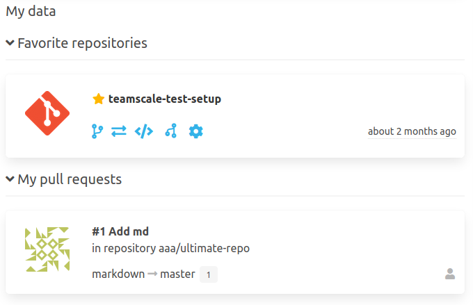

The area "My data" provides user related information like favorite repositories or own pull requests.

### Favorite repositories
With the landingpage-plugin user can favorize their most interesting repositories using the star icon. 
Their favorite repositories will all be shown on the "mySCM" page.

### Meine Pull Requests
If the review-plugin is also installed, their own pull requests will be shown for each user.

