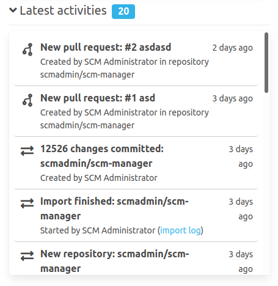

In the "latest activities" several events which the user may see are listed chronologically.
The latest activities are filtered by the permissions of the user. So the user will only see events in repositories which are accessible.

