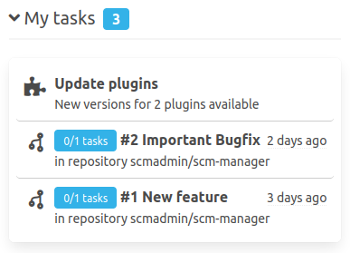

When working with the SCM-Manager it is quite possible some tasks may appear. For Example with the review-plugin installed, reviewers can created tasks on open pull requests. This way they can express their change requests. 

### Administrative tasks
The administrative tasks will be shown to users which can administrate the SCM-Manager instance.
A possible tasks may be "update outdated plugins".

### Tasks from pull requests
If a user creates a pull request the reviewers can request changes via tasks. The pull requests author will see his tasks on the personal page.

