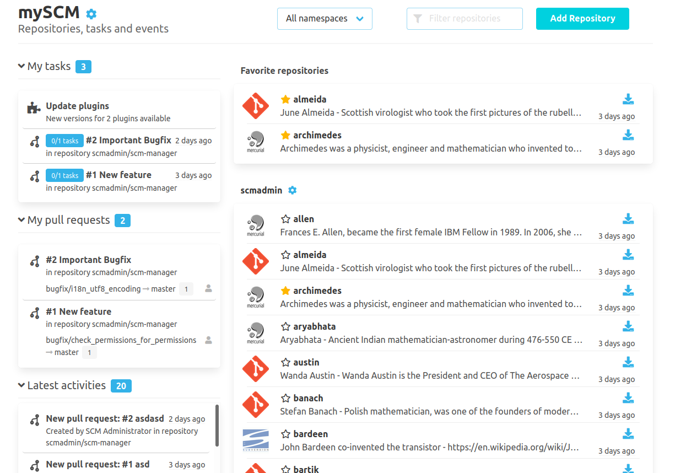

The repository overview is extended by several widgets that provide additional information.
Each area is user-related and permission checked. It will show the users exactly as many as they may see.
What is displayed can be configured by the users. Other plugins may integrate with this plugin to display their own widgets
or enrich existing ones.

Furthermore, the title of the instance (by default "mySCM") can be adjusted. This setting can be made by
administrators under "Settings - Landingpage".

