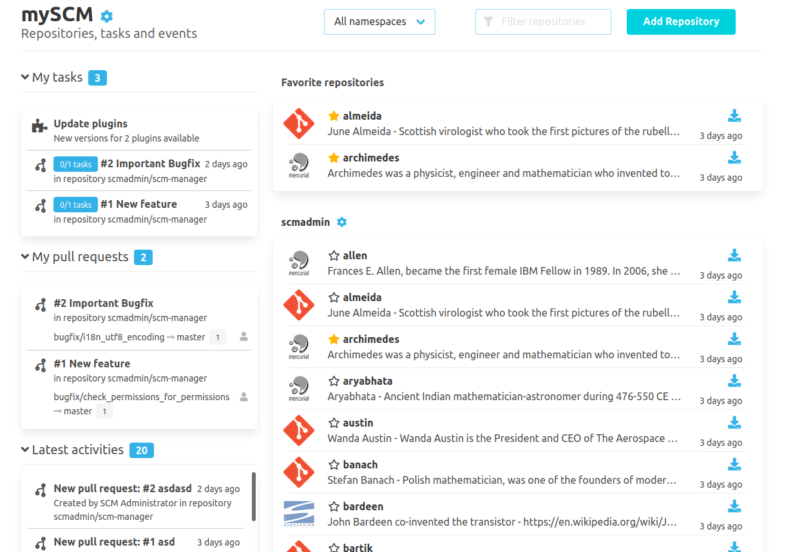

The repository overview is extended by several widgets that provide additional information.
Each area is user-related and permission-checked. It will show each user those elements that their permissions grant them to see.
The content can be configured by the users. Other plugins may interact with this plugin to display their own widgets
or enrich existing ones.

Furthermore, the title of the instance (by default: “MySCM”) can be adjusted. This setting can be made by
administrators under “Settings – Landingpage”.

